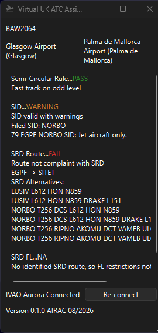
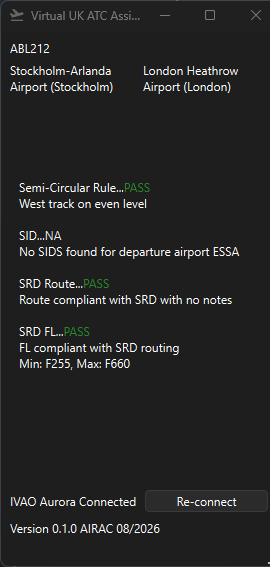

# SRD Flight Plan Checker

**The SRD flight plan checker is an addon to IVAO Aurora. The software detects
the selected aircraft and runs a series of checks to verify if the route is
compliant with the published NATS SRD for the current AIRAC. The software
aims to aid clearance and delivery controllers with providing a realistic service.**

**This software is not for real world use!**

This is not a replacement for aerodrome knowledge however, and controllers still 
require good aerodrome and atc knowledge to interpret the results of the tests
and to consider if action must be taken on the flight plan

## Features:
- Flight plan checks
  - Semi-circular rule enforcement (not accounting for North-South layout in other 
  countries can cause some false negatives)
  - SID checking - checks user has filed valid sid in the SRD, warns controllers of any
  notes pertaining to the SID in the SRD (currently no automatic verification based on aircraft type etc)
  - SRD route checking - identifies airspace entry/exit points for all inbounds, outbounds and overflights if contained
  in the SRD. Compares the routing and offers alternatives if invalid
  - SRD FL check - If compliant SRD routing is found the min/max FL is also checked
- UI
  - Always on-top window allows seamless use with IVAO Aurora. Clicking an IFR aircraft automatically
  displays checks
  - Departure and arrival airport names are also identified for clearances
- Automatic SRD download based on current AIRAC cycle

## Usage
- Download the `.exe` file in the Releases tab
- Enable third party server on Aurora (in the Other section)
- Run Aurora, run the flight plan checker

## Screenshots

## Credits

- SRD data source - [Nats AIP](https://nats-uk.ead-it.com/cms-nats/opencms/en/home/)
- Airport data source - [OurAirports Open Data](https://ourairports.com/data/)
- Aircraft data source - [UK CAA Wake Turbulence Categories](https://www.caa.co.uk/commercial-industry/airspace/air-traffic-management-and-air-navigational-services/air-navigation-services/uk-wake-turbulence-categories/)

